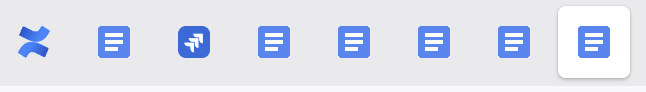
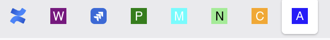

# Google Docs Favicon Tab Change

A UserScript (compatible with GreaseMonkey, TamperMonkey, FireMonkey, etc.) that dynamically changes the favicon of Google Docs tabs based on the document's unique ID. This is particularly useful when you have multiple Google Docs pinned, allowing for quick visual identification.

Before:



After:



## Icons

You **must** configure the base URL where your custom favicons are hosted.

*   Open the `userscript.js` script for editing in your UserScript manager.
*   Find the following line at the top of the script:
    ```javascript
    const CUSTOM_FAVICON_BASE_URL = "https://fmushosting.vellut.com/docicons";
    ```
*   Replace `"https://fmushosting.vellut.com/docicons"` with the URL to the directory where you will store your icons (without the `/`)

### Icon Naming Convention

Your custom favicon files **must** be named according to the Google Document ID they correspond to, followed by the `.png` extension.

*   **Format:** `<Google_Doc_ID>.png`
*   **Example:** If a Google Doc URL is `https://docs.google.com/document/d/1a4ni7I0XKe5iSa3gv-UWEM9XDLF-eozvJVvZHspdaPE/edit`, the corresponding icon must be named `1a4ni7I0XKe5iSa3gv-UWEM9XDLF-eozvJVvZHspdaPE.png`.

The script will automatically look for `[YOUR_BASE_URL]/[DocumentID].png`.

### Icon Hosting

Your icons need to be publicly accessible via HTTP/HTTPS. Here are some recommended hosting options:

*   **Cloud Storage Services:**
    *   Amazon S3 (with public read access)
    *   Google Cloud Storage (with public read access)
    *   Cloudflare R2 (with public read access)
*   **Your Own Web Server:** If you have a personal web server or hosting.
*   **Image Hosting Services:** Some image hosting services might work, but ensure they provide direct links to the `.png` files and allow hotlinking.

**Important:** Ensure your icons are `PNG` files. The script currently specifies `type='image/png'`.

## Icon generator

This project includes a Python script, `main.py`, designed to help you generate custom letter-based favicons. This is particularly useful for creating a consistent visual style for your Google Docs tabs.

**Using the `main.py` Icon Generator Script:**

The `main.py` script is a command-line tool that generates `.png` favicon images with a specified letter, background color, and letter color.

1.  **Prerequisites:**
    *   `uv` installed.
    *   `uv sync` in the project directory
    *   Ensure the font specified in `main.py` (default is "Helvetica"; already there on macOS) is available on your system, or modify the `DEFAULT_FONT_PATH` in the script.
    *   Configure the `OUTPUT_DIR` variable in the script

2.  **How to Run `main.py`:**
    *   Navigate to the project directory in your terminal.
    *   Run the script with appropriate options. For example:
        ```bash
        python main.py -l A -b blue -c white --resolution 32 32
        ```
        This command will generate a favicon with the letter 'A', a blue background, and white text, at a 32x32 resolution (the text and resolution are defaults so can be omitted.)
    *   The generated favicons will be saved in a subdirectory named `docicons` (or as configured by `OUTPUT_DIR` in the script).
    *   **Important:** The `main.py` script generates filenames like `favicon_A_blue_white_32x32.png`. You will need to **manually rename** these generated files to match the Google Document ID: `<Google_Doc_ID>.png`. For example, if your document ID is `1a4ni7I0XKe5iSa3gv-UWEM9XDLF-eozvJVvZHspdaPE`, you would rename the generated icon to `1a4ni7I0XKe5iSa3gv-UWEM9XDLF-eozvJVvZHspdaPE.png`.
    *   For detailed options, run: `python main.py --help`

3.  **Upload Your Icons:**
    *   After generating and correctly renaming your icons, upload them to the directory specified by your `CUSTOM_FAVICON_BASE_URL` (which you configured in the `userscript.js` UserScript).

### Manual Icon Creation

Alternatively, you can always create your favicons manually:
1.  Use any image editor (like GIMP, Photoshop, Figma, or online favicon generators).
2.  Create your icons, typically as `16x16` or `32x32` pixel `.png` files.
3.  Ensure each icon is named correctly according to the convention: `<Google_Doc_ID>.png`.
4.  Upload these manually created icons to your hosting location (defined by `CUSTOM_FAVICON_BASE_URL`).

## Usage

Once installed and configured:
1.  Ensure your custom favicons are uploaded to your specified `CUSTOM_FAVICON_BASE_URL` and correctly named.
2.  Open any Google Doc.
3.  The script will automatically run, and if a corresponding `[DocID].png` icon is found at your base URL, the tab's favicon will change.
4.  Alternatively, refresh the Google Docs tab for the user script to run.

If the favicon doesn't change:
*   Double-check the `CUSTOM_FAVICON_BASE_URL` in the script.
*   Verify the icon naming: `<DocID>.png`.
*   Ensure the icon URL is publicly accessible (try opening `[YOUR_BASE_URL]/[DocID].png` directly in your browser).
*   Check the browser's developer console (usually F12) for any error messages from "Custom Favicon:".
